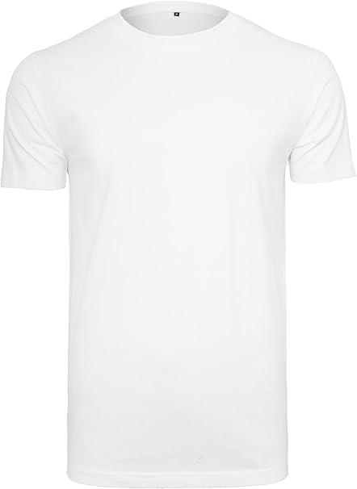
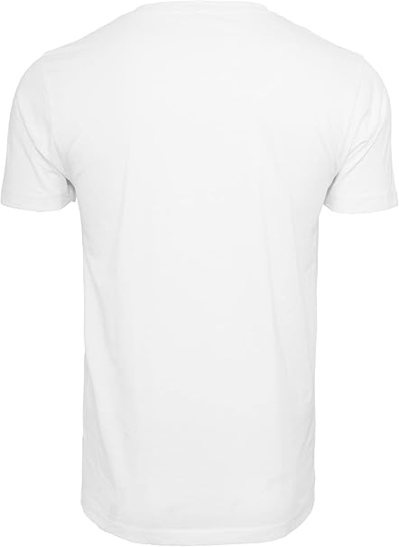
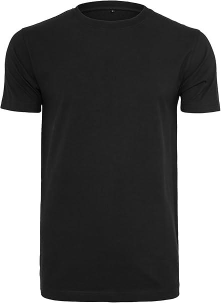
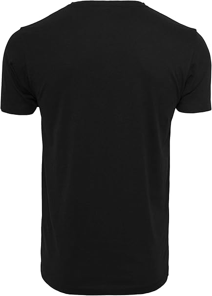
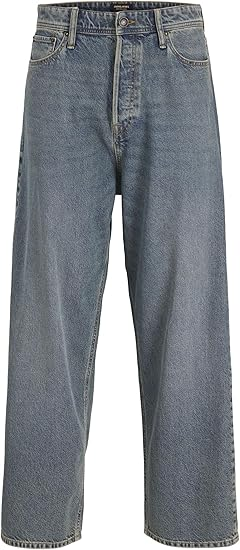
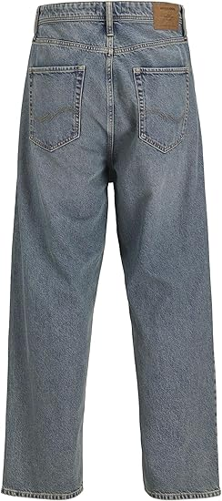
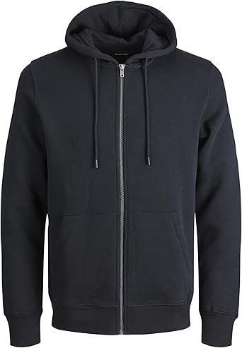
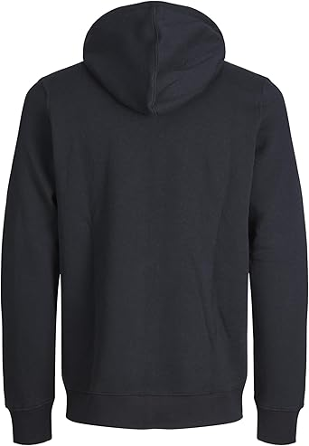

# 👕 GROUP 19 · Fundamentos de la web  
## 🛍️ Project: Online Clothing Store  

This repository contains the development of a web application that simulates an online clothing store.  
The application allows managing clothing items (with associated images) and user reviews, as well as providing search, filtering, and categorization by type of garment.

## 🏷️ Name  
**✨ FashionHub ✨**

## 👨‍💻 Development Team  
- **Sergio González Gútiez** · s.gonzalezg.2023@alumnos.urjc.es · [GitHub](https://github.com/sergiomadrz)  
- **Alejandro Martín Carrera** · a.martinca.2021@alumnos.urjc.es · [GitHub](https://github.com/alejandromartincarrera)  
- **Adrián Esteban Martín** · a.estebanm.2021@alumnos.urjc.es · [GitHub](https://github.com/aadri-2003)
- **Laura Pineda Ballesteros** . l.pineda.2022@alumnos.urjc.es . [GitHub](https://github.com/lauraxpb)

## ⚙️ Functionality  

### 👕 Main entity: **Clothing item**  
We consider our main concept to be stored in the database as a *Clothing item*. This entity will have the following attributes:

| Attribute   | Example                        |
|------------|--------------------------------|
| Name       | Basic white t-shirt            |
| Description| Short sleeve, unisex           |
| Type       | T-shirt, Sweatshirt, Jeans, Sneakers, Socks, Hats     |
| Size       | XS, S, M, L, XL, XXL           |
| Fabric     | Cotton                         |
| Color      | Black                          |
| Price      | €19.99                         |
| Images     |                                |

### ⭐ Secondary entity: **Review**  
Each review is associated with a specific clothing item, and a clothing item can have multiple reviews. The attributes we will consider are:  

| Attribute | Example                             |
|-----------|-------------------------------------|
| Author    | @juan23                             |
| Text      | "The t-shirt has good quality"      |
| Rating    | 4/5 stars                           |
| Date      | 2025-03-02                          |
| Image     |                                     |

### 🖼️ Images  
Each clothing item will have at least one associated image, which can be uploaded from the browser.  

####  White T-shirt

####  Black T-shirt

####  Jeans

####  Sweatshirt

### 🔍 Search, Filtering, and Categorization  
- **Search**: text box that searches items by name or description.  
- **Filtering**: by size, color, price, or material.  
- **Categorization**: by type of garment (T-shirt, Sweatshirt, Jeans, Sneakers, Socks, Hats).  

### 👩‍🎨 Individual Contributions  
- **Laura Pineda Ballesteros**: Search functionality, fixing positioning issues, styling adjustments.

----

💻 *Developed by Group 19 · Fundamentos de la web*
